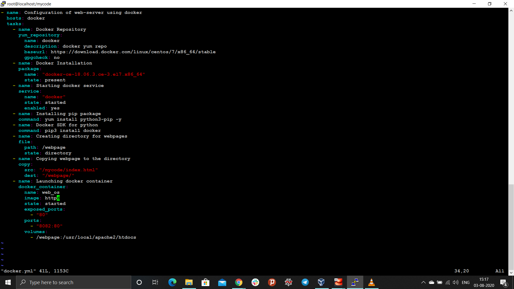
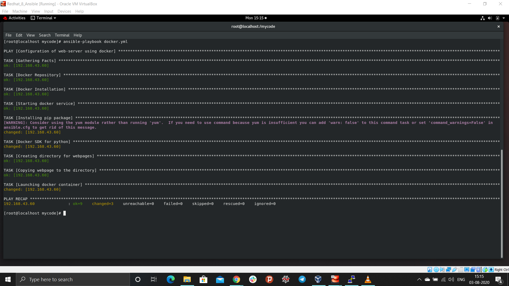
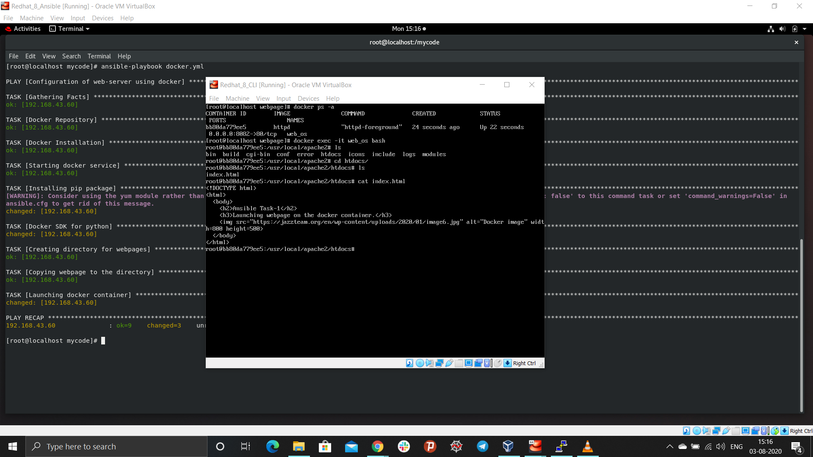
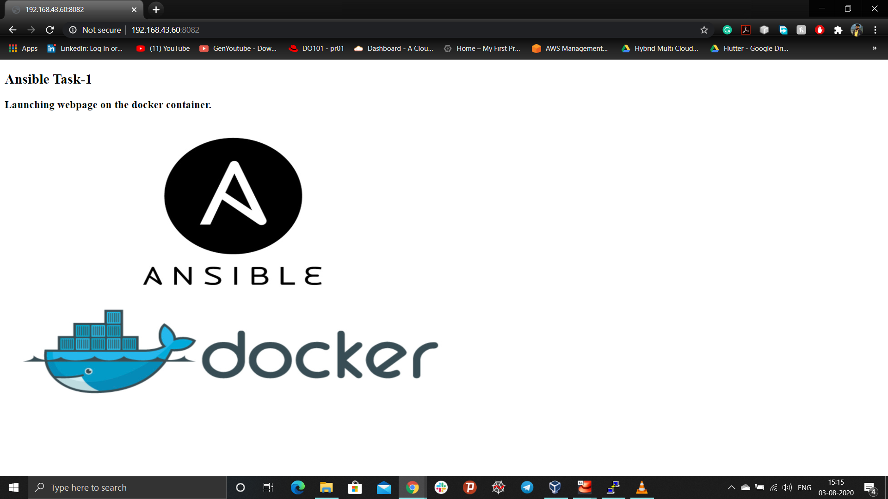

## Automating configuration management using Ansible
*In this project fully configured docker container(O.S i.e. httpd) is launched to host the website using Ansible.*

Automation is crucial these days, with IT environments that are too complex and often need to scale too quickly for system administrators and developers to keep up if they had to do everything manually. Automation simplifies complex tasks, not just making developers’ jobs more manageable but allowing them to focus attention on other tasks that add value to an organization. In other words, it frees up time and increases efficiency.

### What is Ansible?
Ansible is an open-source automation tool, or platform, used for IT tasks such as configuration management, application deployment, intraservice orchestration, and provisioning.

### What is Ansible-Playbook?
Playbooks are Ansible’s configuration, deployment, and orchestration language. They can describe a policy you want your remote systems to enforce, or a set of steps in a general IT process. If Ansible modules are the tools in your workshop, playbooks are your instruction manuals, and your inventory of hosts are your raw material.

### Problem Statement:
Write an Ansible PlayBook that does the following operations in the managed nodes:
```
1. Configure Docker
2. Start and enable Docker services
3. Pull the httpd server image from the Docker Hub
4. Run the httpd container and expose it to the public
5. Copy the html code in /var/www/html directory and start the web server
```
### Prerequisite:
System has to be pre-configured with python, pip, ansible.

### Detail setup of the environment:
1. Install python3 in the system
```
yum install python3 -y
```
2. Install pip library in the system
```
yum install python3-pip -y
```
3. Install Ansible in the system
```
pip3 install ansible
```
4. Create the inventory(databases of host system) for the ansible. Provide the host information in this file for remote login.
- [web]/[docker] are group of hosts.
- IP address of the hosts
- Username & Password of the hosts
```
[root@localhost ~]# cat /etc/myhosts.txt
[web]
192.168.43.139 ansible_ssh_user=root ansible_ssh_pass=redhat

[docker]
192.168.43.60 ansible_ssh_user=root ansible_ssh_pass=redhat
```
5. Defining the path of the inventory to the ansible. Ansible always look for the inventory information to the ansible.cfg file.
```
[root@localhost ~]# cat /etc/ansible/ansible.cfg
[defaults]
inventory = /etc/myhosts.txt
host_key_checking = False
```
6. Write the ansible-playbook to configure the system in YAML format.

### Solution

**Job1:** Configure Docker environment to the host system.
- Host is docker group specified in the inventory
- Configuring yum for the docker
- Installing stable version of the docker
```
- name: Configuration of web-server using docker
  hosts: docker
  tasks:
    - name: Docker Repository
      yum_repository:
        name: docker
        description: docker yum repo
        baseurl: https://download.docker.com/linux/centos/7/x86_64/stable
        gpgcheck: no
    - name: Docker Installation
      package:
        name: "docker-ce-18.06.3.ce-3.el7.x86_64"
        state: present
```
**Job2:** Start and enabling Docker services
```
- name: Starting docker service
  service:
    name: "docker"
    state: started
    enabled: yes
```
- Installing docker SDK for python3
```
- name: Installing pip package
  command: yum install python3-pip -y
- name: Docker SDK for python
  command: pip3 install docker
```
- Create a directory in the host and copy the web-pages in that directory
```
- name: Creating directory for webpages
  file:
    path: /webpage
    state: directory
- name: Copying webpage to the directory
  copy:
    src: "/mycode/index.html"
    dest: "/webpage/"
```
**Job3:** Pull the httpd server image from the Docker Hub
**Job4:** Run the httpd container and expose it to the public
- Docker container is exposed to the public at port 8082
**Job5:** Copying the html code in the default directory for the apache webserver and starting the web server
- default directory for web hosting in httpd image : /usr/local/apache2/htdocs
```
- name: Launching docker container
  docker_container:
    name: web_os
    image: httpd
    state: started
    exposed_ports:
      - "80"
    ports:
      - "8082:80"
    volumes:
      - /webpage:/usr/local/apache2/htdocs
```



- Run the ansible-playbook via command line
```
ansible-playbook docker.yml
```
- Output of the console



- Container launch in the host system
```
docker ps -a
```


- Webpage hosted on the conatainer, apache web-server



### Thank You.
